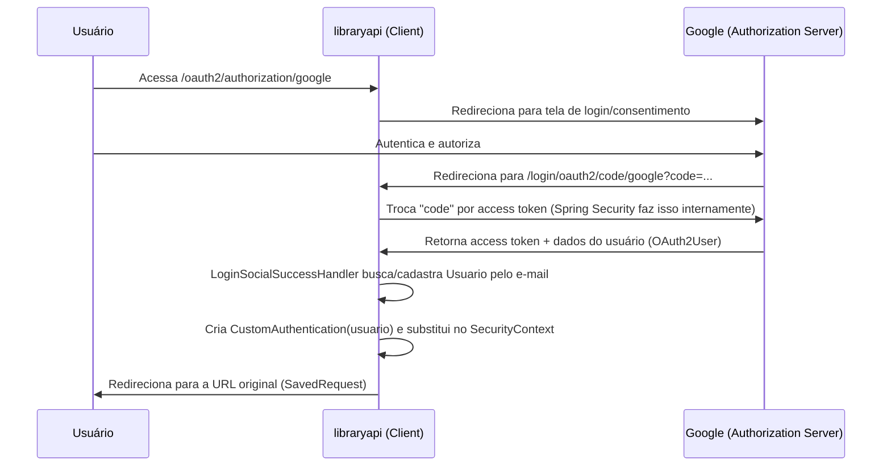

# OAuth2 — Guia de Estudos

> Documento de estudo baseado na implementação real deste projeto (`libraryapi`), que usa **Spring Security** com login tradicional (usuário/senha) e login social via **OAuth2 com Google**.

---

## 1. O que é OAuth2

OAuth2 é um **protocolo de autorização** (não de autenticação). Ele define como uma aplicação (o *client*, no nosso caso o `libraryapi`) pode obter acesso a informações de um usuário que estão em outro serviço (o *provider*, no nosso caso o Google) **sem que o usuário precise informar sua senha do Google para a nossa aplicação**.

Pontos-chave:

- **Resource Owner**: o usuário, dono dos dados (conta Google).
- **Client**: nossa aplicação (`libraryapi`), que quer acessar informações do usuário.
- **Authorization Server**: o servidor do Google que autentica o usuário e emite tokens.
- **Resource Server**: onde ficam os dados protegidos (ex: API do Google que expõe e-mail, nome, foto).

Na prática, quando falamos em "login com Google", o que acontece por baixo dos panos é:
1. O usuário é redirecionado para o Google.
2. Ele se autentica no Google (não na nossa aplicação).
3. O Google pergunta se autoriza compartilhar os dados solicitados (e-mail, perfil) com a nossa aplicação.
4. O Google redireciona de volta para nossa aplicação com um código de autorização.
5. Nossa aplicação troca esse código por um **access token**.
6. Com o token, nossa aplicação busca as informações do usuário (`OAuth2User`) no Google.

Esse fluxo é chamado de **Authorization Code Flow**, o mais usado em aplicações web server-side — e é exatamente o que o Spring Security implementa automaticamente com `.oauth2Login(...)`.

> **OAuth2 vs OpenID Connect (OIDC)**: OAuth2 puro só cuida de *autorização* (dar acesso a recursos). O login social do Google, que devolve informações de identidade do usuário (nome, e-mail), na verdade usa uma camada chamada **OpenID Connect**, construída em cima do OAuth2. O Spring Security abstrai isso para nós através do `OAuth2User`.

---

## 2. Configuração básica: `application.yml`

```yaml
spring:
  security:
    oauth2:
      client:
        registration:
          google:
            client-id: ${GOOGLE_CLIENT_ID}
            client-secret: ${GOOGLE_CLIENT_ID}
```

- `client-id` e `client-secret` são gerados no **Google Cloud Console** ao criar credenciais OAuth2 para a aplicação.
- O Spring Security reconhece o nome `google` automaticamente e já sabe as URLs padrão do Google (endpoint de autorização, de token, de userinfo, escopos `openid`, `profile`, `email`, etc.) — isso é possível porque o Google é um provider "conhecido" (`CommonOAuth2Provider`).
- As credenciais **nunca devem ser hardcoded** — por isso vêm de variáveis de ambiente (`${GOOGLE_CLIENT_ID}` / `${GOOGLE_CLIENT_SECRET}`).

---

## 3. Habilitando OAuth2 Login no Spring Security

Arquivo: [`SecurityConfiguration.java`](../src/main/java/io/github/com/libraryapi/config/SecurityConfiguration.java)

```java
@Bean
public SecurityFilterChain securityFilterChain(HttpSecurity http, LoginSocialSuccessHandler successHandler) throws Exception {
    return http
            .csrf(AbstractHttpConfigurer::disable)
            .httpBasic(Customizer.withDefaults())
            .formLogin(configurer -> {
                configurer.loginPage("/login");
            })
            .authorizeHttpRequests(authorize -> {
                authorize.requestMatchers("/login").permitAll();
                authorize.requestMatchers("/usuarios/**").permitAll();
                authorize.anyRequest().authenticated();
            })
            .oauth2Login(oauth2 -> {
                oauth2
                    .loginPage("/login")
                    .successHandler(successHandler);
            })
            .build();
}
```

O que cada parte faz, focando no OAuth2:

- **`.oauth2Login(...)`**: habilita o fluxo completo de login social. O Spring Security cria automaticamente as rotas:
  - `/oauth2/authorization/google` → inicia o fluxo, redirecionando o usuário para a tela de login do Google.
  - `/login/oauth2/code/google` → *redirect URI* de callback, para onde o Google devolve o usuário após autenticação, com o `code` de autorização.
- **`.loginPage("/login")`**: reaproveita a mesma página de login tanto para o form tradicional quanto para exibir o botão "Entrar com Google" (a página HTML em `resources` é quem monta o link para `/oauth2/authorization/google`).
- **`.successHandler(successHandler)`**: depois que o Google autentica o usuário com sucesso, o Spring Security chama o `LoginSocialSuccessHandler` para decidir o que fazer com esse usuário dentro da nossa aplicação (é aqui que a "mágica" do projeto acontece — ver seção 5).
- **`authorizeHttpRequests`**: define que `/login` e `/usuarios/**` são públicos, e todo o resto exige autenticação (seja via form login, HTTP Basic ou OAuth2).

---

## 4. O problema: o retorno do OAuth2 não é padronizado

Quando o login é feito via `formLogin` ou `httpBasic`, o Spring Security popula o `Authentication` com um `UsernamePasswordAuthenticationToken`, cujo `principal` normalmente é um `UserDetails`.

Quando o login é feito via OAuth2, o Spring popula o `Authentication` com um **`OAuth2AuthenticationToken`**, cujo `principal` é um **`OAuth2User`** — um objeto genérico que representa os atributos devolvidos pelo provider (no caso do Google: `email`, `name`, `picture`, `sub`, etc.), **e não** o nosso `Usuario` (entidade do domínio).

Ou seja: dependendo de como o usuário logou, o restante da aplicação (controllers, `SecurityService`, etc.) receberia tipos de `Authentication` diferentes, com formatos de dados diferentes. Isso obrigaria todo o código que depende do usuário logado a tratar múltiplos formatos.

A solução do projeto foi criar uma abstração própria: a **`CustomAuthentication`**.

---

## 5. `CustomAuthentication`: padronizando o resultado do login

Arquivo: [`CustomAuthentication.java`](../src/main/java/io/github/com/libraryapi/security/CustomAuthentication.java)

```java
public class CustomAuthentication implements Authentication {

    private final Usuario usuario;

    @Override
    public Collection<? extends GrantedAuthority> getAuthorities() {
        return this.usuario
                .getRoles()
                .stream()
                .map(SimpleGrantedAuthority::new)
                .collect(Collectors.toList());
    }

    @Override
    public Object getPrincipal() {
        return User.builder()
                .username(usuario.getLogin())
                .password(usuario.getSenha())
                .authorities(getAuthorities())
                .build();
    }

    @Override
    public boolean isAuthenticated() {
        return true;
    }

    @Override
    public String getName() {
        return usuario.getLogin();
    }
    // ...
}
```

Ideia central: **independente de como o login aconteceu** (usuário/senha, HTTP Basic ou Google via OAuth2), o restante da aplicação sempre recebe um `Authentication` que carrega o nosso `Usuario` (entidade de domínio), com o mesmo formato de `authorities` e o mesmo `getName()`.

Detalhe importante sobre `GrantedAuthority` (comentado no próprio código): o Spring Security por padrão espera que roles tenham o prefixo `ROLE_` (ex: `ROLE_GERENTE`). Como as roles do `Usuario` são salvas sem esse prefixo (ex: `GERENTE`), o projeto resolveu isso configurando:

```java
@Bean
public GrantedAuthorityDefaults grantedAuthorityDefaults() {
    return new GrantedAuthorityDefaults("");
}
```

Isso faz o Spring Security parar de exigir o prefixo `ROLE_`, permitindo comparar as authorities exatamente como estão salvas no banco.

---

## 6. `CustomAuthenticationProvider`: o caminho do login tradicional

Arquivo: [`CustomAuthenticationProvider.java`](../src/main/java/io/github/com/libraryapi/security/CustomAuthenticationProvider.java)

```java
@Override
public Authentication authenticate(Authentication authentication) throws AuthenticationException {
    String login = authentication.getName();
    String senhaDigitada = authentication.getCredentials().toString();

    Usuario user = usuarioService.obterPorLogin(login);
    if (user == null) throw getErroUsuarioNaoEncontrado();

    boolean isCorrectPassword = encoder.matches(senhaDigitada, user.getSenha());
    if (!isCorrectPassword) throw getErroUsuarioNaoEncontrado();

    return new CustomAuthentication(user);
}
```

Este componente entra em ação quando o login é feito via `formLogin`/`httpBasic` (usuário e senha). Ele:
1. Recebe o `UsernamePasswordAuthenticationToken` que o Spring monta a partir do formulário.
2. Busca o `Usuario` no banco pelo login.
3. Valida a senha com `PasswordEncoder` (BCrypt).
4. Se tudo estiver certo, devolve já um **`CustomAuthentication`** — ou seja, mesmo no fluxo tradicional, o resultado final já sai padronizado.

Esse fluxo **não envolve OAuth2** diretamente, mas é o "espelho" do que o `LoginSocialSuccessHandler` faz para o fluxo OAuth2 — os dois convergem para o mesmo tipo de `Authentication`.

---

## 7. `LoginSocialSuccessHandler`: adaptando o retorno do Google

Arquivo: [`LoginSocialSuccessHandler.java`](../src/main/java/io/github/com/libraryapi/security/LoginSocialSuccessHandler.java)

```java
@Component
@RequiredArgsConstructor
public class LoginSocialSuccessHandler extends SavedRequestAwareAuthenticationSuccessHandler {

    private static final String SENHA_PADRAO = "123";

    private final UsuarioService usuarioService;
    private final PasswordEncoder encoder;

    @Override
    public void onAuthenticationSuccess(
            HttpServletRequest request,
            HttpServletResponse response,
            Authentication authentication
    ) throws ServletException, IOException {
        OAuth2AuthenticationToken auth2AuthenticationToken = (OAuth2AuthenticationToken) authentication;

        OAuth2User oAuth2User = auth2AuthenticationToken.getPrincipal();
        String email = oAuth2User.getAttribute("email");
        Usuario usuario = usuarioService.obterPorEmail(email);

        if (usuario == null) {
            usuario = cadastrarUsuario(email);
        }

        authentication = new CustomAuthentication(usuario);

        SecurityContextHolder.getContext().setAuthentication(authentication);

        super.onAuthenticationSuccess(request, response, authentication);
    }

    private Usuario cadastrarUsuario(String email) {
        Usuario usuario = new Usuario();
        usuario.setEmail(email);

        String login = email.substring(0, email.indexOf("@"));
        usuario.setLogin(login);
        usuario.setSenha(encoder.encode(SENHA_PADRAO));
        usuario.setRoles(List.of("OPERADOR"));

        usuarioService.salvar(usuario);
        return usuario;
    }
}
```

Esse é o coração da integração com OAuth2. Ele é acionado **somente após o Google confirmar a autenticação do usuário** (ou seja, depois que todo o fluxo OAuth2 — redirecionamento, consentimento, troca de código por token, busca do userinfo — já foi concluído pelo Spring Security internamente).

Passo a passo:

1. **`SavedRequestAwareAuthenticationSuccessHandler`**: classe do Spring Security que, além de permitir customizar o comportamento pós-login, redireciona o usuário para a URL que ele tentava acessar antes de ser mandado para o login (ex: se tentou acessar `/livros` sem estar logado, após o login ele volta para `/livros`).

2. **`(OAuth2AuthenticationToken) authentication`**: nesse ponto, o `Authentication` que o Spring entrega é o token específico do OAuth2, cujo `getPrincipal()` retorna um `OAuth2User` — os dados vindos do Google (e-mail, nome, foto, `sub`, etc.), e não o nosso `Usuario`.

3. **`oAuth2User.getAttribute("email")`**: extrai o e-mail retornado pelo Google. É o único dado confiável que conseguimos correlacionar com nossa base de usuários.

4. **Provisionamento automático (*JIT — Just-In-Time*)**: se não existe um `Usuario` com esse e-mail, ele é **criado automaticamente** (`cadastrarUsuario`), com:
   - `login` derivado do e-mail (parte antes do `@`);
   - senha padrão criptografada (`"123"`) — só existe para satisfazer o modelo de dados, já que o usuário nunca vai logar com senha, sempre via Google;
   - role padrão `OPERADOR`.

   > Isso é um padrão comum em login social: como não pedimos ao usuário para "criar uma conta", a aplicação precisa decidir sozinha o que fazer no primeiro login (criar registro local, vincular a conta existente pelo e-mail, etc.).

5. **`new CustomAuthentication(usuario)`**: aqui está a conversão. O `OAuth2AuthenticationToken` (específico do Google) é substituído por um `CustomAuthentication` (o mesmo tipo usado no login tradicional), carregando o `Usuario` do nosso domínio.

6. **`SecurityContextHolder.getContext().setAuthentication(authentication)`**: sobrescreve o `Authentication` do contexto de segurança da requisição atual com a versão padronizada — a partir daqui, qualquer código que ler o `Authentication` (ex: `Authentication auth` injetado em um `@Controller`, ou o `SecurityService`) vai enxergar sempre um `CustomAuthentication`, nunca um `OAuth2AuthenticationToken` cru.

7. **`super.onAuthenticationSuccess(...)`**: delega para a implementação padrão do Spring, que cuida do redirecionamento final.

---

## 8. `SecurityService`: consumindo o usuário logado de forma centralizada

Arquivo: [`SecurityService.java`](../src/main/java/io/github/com/libraryapi/security/SecurityService.java)

```java
@Component
@RequiredArgsConstructor
public class SecurityService {

    private final UsuarioService usuarioService;

    public Usuario obterUsuarioLogado() {
        Authentication auth = SecurityContextHolder.getContext().getAuthentication();

        if (auth instanceof CustomAuthentication customAuthentication) {
            return customAuthentication.getUsuario();
        }

        return null;
    }
}
```

Graças a toda a padronização feita nas seções anteriores, este serviço consegue obter o `Usuario` logado de forma **única**, sem precisar saber se o login foi via formulário, HTTP Basic ou Google:

- Ele lê o `Authentication` atual do `SecurityContextHolder`.
- Faz um `instanceof CustomAuthentication` — que **sempre** será verdadeiro, seja qual for o mecanismo de login usado, porque tanto o `CustomAuthenticationProvider` (login tradicional) quanto o `LoginSocialSuccessHandler` (login Google) entregam esse mesmo tipo ao contexto de segurança.
- Retorna o `Usuario` de domínio diretamente, pronto para ser usado em regras de negócio (ex: "quem cadastrou este livro?").

Esse é o principal ganho de ter criado a abstração: **qualquer novo provider OAuth2 que for adicionado no futuro** (ex: login com GitHub, Facebook) só precisa de um `SuccessHandler` equivalente ao `LoginSocialSuccessHandler`, convertendo o retorno daquele provider para `CustomAuthentication` — o resto da aplicação (`SecurityService`, controllers, etc.) não muda nada.

---

## 9. Visão geral do fluxo completo (Google)



---

## 10. Resumo — por que essa arquitetura existe

| Componente | Papel no OAuth2 |
|---|---|
| `application.yml` | Guarda `client-id`/`client-secret` do provider (Google), via variáveis de ambiente. |
| `SecurityConfiguration` | Liga o `.oauth2Login()` no filtro de segurança e registra o `successHandler` customizado. |
| `LoginSocialSuccessHandler` | Recebe o retorno bruto do OAuth2 (`OAuth2AuthenticationToken`/`OAuth2User`), busca/cria o `Usuario` local pelo e-mail e converte para `CustomAuthentication`. |
| `CustomAuthenticationProvider` | Faz o equivalente para o login tradicional (usuário/senha), também entregando um `CustomAuthentication`. |
| `CustomAuthentication` | Contrato único de `Authentication` usado por toda a aplicação, independente do mecanismo de login. |
| `SecurityService` | Ponto único de consulta ao usuário logado, consumido pelo resto do sistema. |

A grande lição de estudo aqui: **o Spring Security cuida de todo o protocolo OAuth2** (redirect, troca de código por token, chamada ao userinfo) — o trabalho da aplicação é apenas **traduzir o resultado** desse protocolo (um `OAuth2User` genérico) para o modelo de domínio próprio (`Usuario`), de forma que o restante do código nunca precise saber que OAuth2 existe.

---

## 11. Para estudar mais

- Spring Security Reference — [OAuth2 Login](https://docs.spring.io/spring-security/reference/servlet/oauth2/login/index.html)
- Conceito de *Authorization Code Flow* (RFC 6749, seção 4.1)
- OpenID Connect Core (diferença entre "autorizar acesso a um recurso" e "provar identidade")
- Estratégias de *account linking* (vincular login social a conta existente por e-mail vs. por ID do provider)
